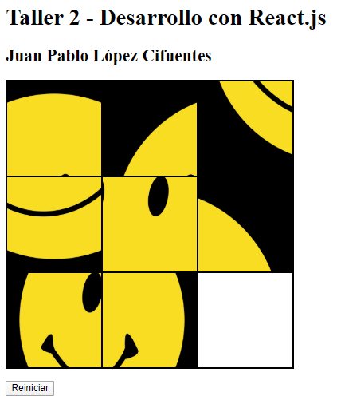

# Desarrollo Web con React.js - Taller 2

Taller 2 para la clase Desarrollo Web con React.js, electiva del programa Ingeniería Informática en la Universidad de La Sabana.

El taller consiste en un rompecabezas deslizante elaborado con HTML, CSS y JavaScript.

Para iniciar abrir archivo index.html.

